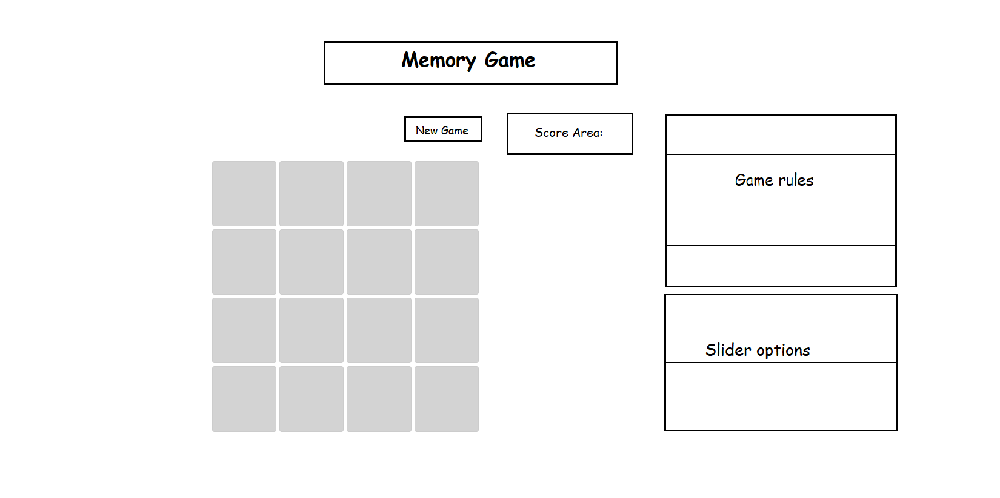
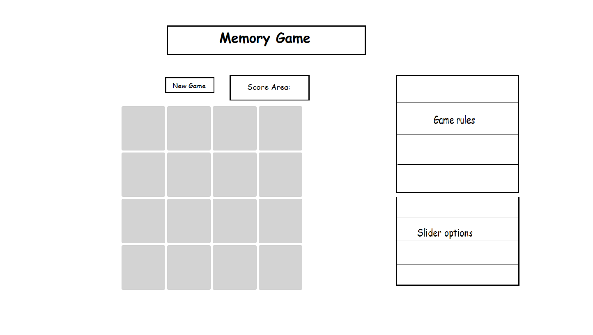
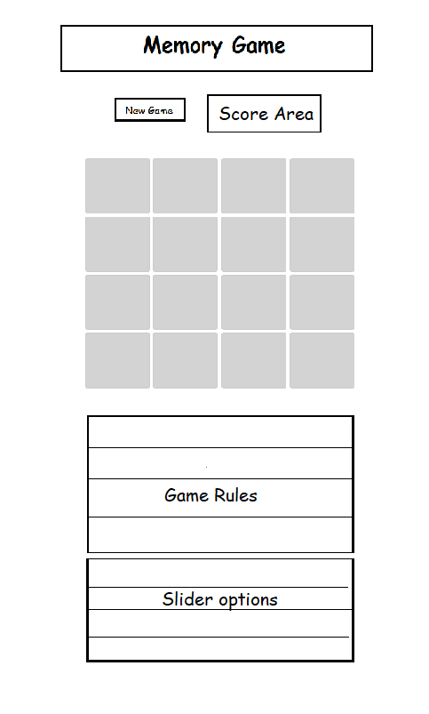

# Memory Game
## Project Overview
This Memory Game project offers players an engaging and customizable memory challenge designed to test and enhance cognitive skills through interactive gameplay. Players can dynamically adjust the game's complexity through intuitive controls, tailoring their experience to their individual skill levels.

### Key Features:

Dynamic Grid Size: Adjust the grid size from a simple 4x4 layout up to a challenging 15x15 grid.

Highlighting Speed Control: Personalize reaction challenges by setting how long each cell remains highlighted, ranging from 100ms to 1 second.

Multiple Highlighted Cells: Increase complexity by selecting up to four cells highlighted per round.

Expert Mode: For advanced players, activate sequential highlights, requiring memorization of both cell locations and the order in which they're highlighted.

Score Tracking: Clearly monitor your correct and incorrect responses to gauge your improvement.

Responsive Design: Enjoy smooth gameplay across devices (desktop, tablet, mobile) thanks to intuitive, Bootstrap-powered responsive design.

Game Instructions: Easily accessible, clear instructions guide new players through gameplay and customization options.

This Memory Game combines simplicity with flexibility, ensuring it’s accessible for beginners while still providing challenging gameplay for advanced players.

# 📌 Memory Game - Rules
## 🎯 Objective

The goal of the game is to accurately remember and click on highlighted cells.
⚙️ Game Options

You can customize the game's difficulty and experience:

    Grid Size: Adjust the size of the game grid (from 4x4 up to 15x15) to increase complexity.

    Speed Control: Adjust the duration for which cells stay highlighted (100ms to 1000ms).

    Cell Count: Choose how many cells (1 to 4) will be highlighted each round.

    Expert Mode: When enabled, cells highlight sequentially rather than simultaneously. You must remember not only the location of highlighted cells but also the order in which they were highlighted.
    (Note: Expert Mode becomes available only when Cell Count is set to 2 or more.)

## 🧩 How to Play

    Set your preferred Grid Size, Speed, and Cell Count using the provided sliders.

    Toggle Expert Mode ON or OFF to change game behavior.

    Press "New Game" to start or restart the game.

    Watch carefully as cells become highlighted:

        Standard Mode: Cells highlight simultaneously.

        Expert Mode: Cells highlight one after another in sequence.

    After cells finish highlighting, click on the cells you remember:

        Standard Mode: Click highlighted cells in any order.

        Expert Mode: You must click highlighted cells in the exact order they appeared.

    The game tracks your correct and incorrect answers, displayed clearly at the top.

## 🎖️ Scoring

    Correct answers increase your correct score.

    Incorrect answers increase your incorrect score.

    You can reset your score anytime by clicking "New Game".
    
# User Stories

## User Story 1: Dynamic Grid Size Adjustment (Must-Have)
**As a Player, I want to dynamically adjust the game grid size from 4x4 to 20x20, enabling me to customize the complexity based on my preference and skill level.**

### Acceptance Criteria
- The default grid size is 4x4.
- Players can adjust grid size using a clear slider control.
- Grid adjusts immediately and smoothly upon changing slider values.

### Tasks
- Implement a responsive grid using JavaScript and CSS.
- Integrate an interactive slider component to control grid dimensions.
- Ensure grid dynamically regenerates based on the slider input.

---

## User Story 2: Adjustable Highlighting Speed (Should-Have)
**As a Player, I want to control how long each cell remains highlighted, ranging from 100ms to 1 second, to personalize the game's difficulty and my reaction challenge.**

### Acceptance Criteria
- Default highlighting duration is 500ms.
- Highlight duration adjustable via slider clearly labelled with values.
- Highlight changes take immediate effect when slider adjustments are made.

### Tasks
- Implement slider input to control highlight duration.
- Connect slider value directly to JavaScript highlighting logic.
- Ensure smooth transition and immediate feedback.

---

## User Story 3: Number of Highlighted Cells Control (Must-Have)
**As a Player, I want the ability to select how many cells (1 to 4) are highlighted per round, increasing the complexity and enhancing replayability.**

### Acceptance Criteria
- Default highlighted cell number is 1.
- Player can increase highlighted cells up to 4 using a slider.
- Selected number of highlighted cells accurately reflects in-game.

### Tasks
- Implement slider component to select highlighted cell count.
- Update game logic to highlight the selected number of cells each round.

---

## User Story 4: Expert Mode with Sequential Highlights (Could-Have)
**As an Advanced Player, I want to activate an "Expert Mode," where highlighted cells appear sequentially (rather than simultaneously), challenging me to memorize not just the cells but also the order of highlights.**

### Acceptance Criteria
- "Expert Mode" option becomes available when multiple highlighted cells are selected.
- Highlighted cells appear sequentially with clear timing intervals.
- Players must correctly recall both cells and highlight order.

### Tasks
- Design and implement "Expert Mode" toggle switch in UI.
- Update highlighting logic for sequential highlighting.
- Create input mechanism to check both cell and order accuracy.

---

## User Story 5: Score Tracking (Must-Have)
**As a Player, I want my correct and incorrect responses clearly tracked and displayed, so I can monitor my progress and performance during the game.**

### Acceptance Criteria
- Correct and incorrect scores displayed prominently.
- Scores update accurately and immediately after each interaction.

### Tasks
- Implement score tracking variables in JavaScript.
- Display scores dynamically on the game interface.

---

## User Story 6: Intuitive and Responsive Interface (Must-Have)
**As a New Player, I need a clean, intuitive, and responsive interface, ensuring smooth gameplay on various devices (desktop, tablet, mobile).**

### Acceptance Criteria
- Interface uses Bootstrap for responsiveness.
- Clearly labelled sliders and toggle switches.
- Interface adapts seamlessly to various screen sizes.

### Tasks
- Design UI layout with Bootstrap.
- Optimize responsiveness and usability across devices.

---

## User Story 7: Game Instructions and Help Section (Could-Have)
**As a New Player, I want easy access to clear instructions or a help section, guiding me on how to play and adjust the game's settings effectively.**

### Acceptance Criteria
- Instructions clearly outline gameplay rules and control adjustments.
- Easily accessible help button or section in the UI.

### Tasks
- Write clear and concise game instructions.
- Integrate help/instructions section into the game interface.

---

# Wireframes:

### Desktop version


### Tablet version


### Mobile version


## 🐞 Bug Fix: Preventing Multiple Clicks and Timer Overlaps

## Issue 1
### When quickly clicking multiple cells, timers controlling cell highlighting and game rounds overlapped, causing multiple cells to highlight simultaneously and eventually freezing the game.

### 🔍 Testing & Findings
- Identified two independent `setTimeout` calls (highlight timer and new-round timer) causing timing conflicts.
- Rapid clicks triggered multiple timers, leading to overlapping highlights and inconsistent gameplay.

### ✅ Implemented Fixes
- **Managed Timers Explicitly:**  
  Introduced dedicated variables (`highlightTimeout`, `newRoundTimeout`) to clearly track and manage each timer individually.
  
- **Cleared Previous Timers:**  
  Used `clearTimeout()` before initiating new rounds or highlighting actions to eliminate conflicts from previously running timers.
  
- **Immediate Click Disabling:**  
  Disabled additional clicks immediately after the player's first interaction each round, preventing unintended behaviors until the next round properly initiates.

###  Result
The game now runs smoothly without overlapping highlights or freezes, providing a stable and consistent gameplay experience.

## Issue 2
### Game grid starts as 4x8 instead of 4x4
### ✅ Implemented Fixes
Removed
> const gridSize = 4;

Added to
>function()
  >clearTimeout(highlightTimeout);
  >clearTimeout(newRoundTimeout);

  Removed
  
  > // Update the grid whenever the slider changes
> slider.addEventListener('input', updateGrid);

Added & Updated

>  if (totalCells > 0) {
>        startGame();
>    }

## Issue 3
### If grid size slider moved, game stop working
### 🔍 Testing & Findings

Incomplete State Reset: When  is called, it clears all timeouts, resets scores, and calls . However, any pending logic from the previous game round (like an ongoing timeout or  state) might not be fully resolved. Make sure  is explicitly reset to  at the start of .

Empty Grid: If the slider is moved too quickly, the  line clear the grid before it has a chance to find valid cells, causing the game logic to break.
Adding a check for whether the grid contains cells before starting the game.
### ✅ Implemented Fixes
### Code:
```javascript
<script>    const slider = document.getElementById('grid-slider');
const grid = document.getElementById('game-grid');

function updateGrid() {
    const numColumns = slider.value;
    grid.style.gridTemplateColumns = `repeat(${numColumns}, 1fr)`; // Dynamically updates the columns
    grid.innerHTML = ''; // Clear the existing cells

    // Calculate total number of cells (assume a square grid)
    const totalCells = numColumns * numColumns;

    // Generate grid cells
    for (let i = 0; i < totalCells; i++) {
        const cell = document.createElement('div');
        grid.appendChild(cell);
    }
}

// Initialize the grid
updateGrid();

// Update the grid whenever the slider changes
slider.addEventListener('input', updateGrid);
```
### Code updated to a more appropriate one:
```javascript
function updateGrid() {
    clearTimeout(highlightTimeout);
    clearTimeout(newRoundTimeout);

    const numColumns = slider.value;
    grid.style.gridTemplateColumns = `repeat(${numColumns}, 1fr)`;
    grid.innerHTML = '';

    const totalCells = numColumns * numColumns;

    for (let i = 0; i < totalCells; i++) {
        const cell = document.createElement('div');
        cell.dataset.index = i;
        grid.appendChild(cell);
    }

    // Reset scores and game state
    correctScore = 0;
    incorrectScore = 0;
    awaitingAnswer = false; // Explicitly reset
    updateScores();

    // Only start the game if there are cells
    if (totalCells > 0) {
        startGame();
    }
}

function startGame() {
    clearTimeout(highlightTimeout);
    clearTimeout(newRoundTimeout);

    if (awaitingAnswer) return;

    const cells = document.querySelectorAll('#game-grid div');
    if (cells.length === 0) return;

    // Remove previous event listeners
    cells.forEach(cell => {
        cell.onclick = null;
    });

    activeCell = cells[Math.floor(Math.random() * cells.length)];
    activeCell.classList.add('active');
    awaitingAnswer = true;

    highlightTimeout = setTimeout(() => {
        activeCell.classList.remove('active');
    }, 500);

    cells.forEach(cell => {
        cell.onclick = handleCellClick;
    });
}
```
## Issue 4
### If speed slider moved, speed doesn't change, even it's not 1000ms, but more like 500ms
### 🔍 Testing & Findings
**Slider Value Not Updating**: Although the slider updates the text content in , it's not adjusting the  variable dynamically based on the slider's value.

**Static Timeout Values**: The  and  functions are using hardcoded values ( and ) instead of dynamically tying these delays to .
### ✅ Implemented Fixes
1. Ensure the slider input updates the  value properly
2. Replace all hardcoded timeout values with.
### Changes:
The  now dynamically updates  based on the slider value.
>highlightDuration = sliderValue * 100;

All instances of **setTimeout** now use **highlightDuration** instead of static values (500ms or 1000ms).

>highlightTimeout = setTimeout(() => { ... }, highlightDuration);

>newRoundTimeout = setTimeout(startGame, highlightDuration);

## Issue 5
### When added Cell Count Slider logic, if set up is > 1 active cell, game doesn't wait for all cells clicked, but starts new game as soon as first click is done.
### ✅ Known Issues and Fixes
**Problem:** Game Starts Immediately After 1 Click (When More Clicks Are Needed).

**Fix:**  Added a counter (clickCount) to track the number of clicks in each round. The game now waits for the exact number of required clicks before moving to the next round.

**Problem:** Extra Clicks Counted as Incorrect Answers.
Any clicks beyond the required (cellCount) were being counted as incorrect answers, disrupting gameplay.

**Fix:** 
Limited the number of clicks per round to the value of (cellCount). Additional clicks are now ignored until the next round begins.
```javascript
let clickCount = 0; // Counter for player clicks in the current round

// Increment counter and check clicks
clickCount++;
if (clickCount === cellCount) {
    // All required clicks processed; proceed to next round
}
```
**Problem:** Game Did Not Reset Properly on Grid or Cell Count Change.
 Changing the grid size or active cell count did not always trigger a full reset, leading to overlaps and incorrect state handling.

 **Fix:**
 Ensured the game resets completely by clearing all active cells, timeouts, and click listeners whenever settings are updated.
 ```javascript
 cells.forEach(cell => {
    cell.classList.remove('active'); // Reset visual state
});
```

 **Problem:** Stuck Active Cells.
  Some cells occasionally remained visually highlighted ("stuck") even after a round ended.

  **Fix:**
  Explicitly removed all event listeners from cells during game resets and at the start of new rounds.
  ```javascript
  awaitingAnswer = false;
activeCells = [];
clickCount = 0; // Ensure clean state for new round
```

  ### Additional Improvements:

**Dynamic Highlight Duration:**
Adjusted the highlight duration (highlightDuration) dynamically based on the slider settings, improving gameplay flexibility.
```javascript
highlightDuration = 1100 - (sliderValue * 100); // Adjust duration dynamically
```
**Consistent State Management:**
Improved handling of (awaitingAnswer) and other key state variables to ensure the game transitions smoothly between rounds.

## Issue 6
### Advanced Mode checkbox is not disabled when Cell Count Slider value = 1
### 🔍 Testing & Findings
The issue is caused because the checkbox initially isn't explicitly disabled if the initial cell count is 1 on page load. It looks like it correctly handle it when the slider changes, but not initially.

**Fix:**
Explicitly set the initial checkbox state after initializing the grid (at the end of the code).

Added these lines just after updateGrid():
```javascript
// Initialize Expert Mode checkbox state correctly on page load
if (cellCount <= 1) {
    expertCheckbox.disabled = true;
    expertCheckbox.checked = false;
    isExpertMode = false;
} else {
    expertCheckbox.disabled = false;
}
```
## Issue 7
### clicks during the highlighting phase are not properly processed and counted.
### 🔍 Testing & Findings
**Problem:**
1. Current Logic: The variable (awaitingAnswer) is only set to (true) after all cells have been highlighted. This prevents clicks during the highlighting phase from being registered.
2. Highlighting and Interaction Overlap: The click handling relies on (awaitingAnswer), which delays interaction until the highlighting process completes.
**Fix:** 
Set (awaitingAnswer = true) before the highlighting process starts.
Allow the click handler to process clicks during highlighting by not relying on the highlighting being completed.
### Key Fixes:

1. **(awaitingAnswer) Set Early:**
(awaitingAnswer) is now set to (true) before highlighting starts, allowing the click handler to process clicks during highlighting.
```javascript
// Enable clicks immediately
awaitingAnswer = true;
```
Event listeners () are attached at the start of the round, enabling interaction with cells even while they are highlighted.

2. **Enabled Immediate Interaction:**
Event listeners (onclick) are attached at the start of the round, enabling interaction with cells even while they are highlighted.
```javascript
// Attach event listeners immediately to allow clicks during highlighting
cells.forEach((cell) => {
    cell.onclick = handleCellClick; // Attach event listeners for the current round
});
```
## Issue 8
### The Expert Mode Slider is not disabled when Cell Count = 1
**Problem:**
1. The slider might not be disabled because the (expertSlider) element is not properly referenced or initialized.
2. The event listener might be attached after initialization or not properly updating the slider state.

**Fix:**

Update the logic so that the slider is properly disabled and checked during initialization and whenever the cell count changes.
```javascript
// Initialize Expert Mode slider state on load
if (cellCount <= 1) {
    expertSlider.disabled = true; // Ensure it starts disabled if cell count is 1
    expertSlider.value = "0";
    updateExpertMode("0");
}
```
# 3rd party code.
## Animation - bouncing ball.

Replaced:
```javascript
<h1 class="text-center">Memory Game</h1>
```
With:
``` javascript
<div class="text-center">
        <h1 id="animated-title"></h1>
        <div id="ball"></div>
      </div>
```
Created animation.js file and copied code:
``` javascript
// animation.js

// Insert letters into #animated-title with span wrappers
const titleText = "Memory Game";
const titleContainer = document.getElementById("animated-title");
titleText.split("").forEach(char => {
  const span = document.createElement("span");
  span.textContent = char === " " ? "\u00A0" : char;
  titleContainer.appendChild(span);
});

const ball = document.getElementById("ball");
const letters = document.querySelectorAll("#animated-title span");

const animateBall = async () => {
  while (true) {
    for (const letter of letters) {
      const rect = letter.getBoundingClientRect();
      const scrollTop = window.scrollY || window.pageYOffset;
      const scrollLeft = window.scrollX || window.pageXOffset;

      const ballX = rect.left + scrollLeft + rect.width / 2 - 10;
      const ballY = rect.top + scrollTop - 30;

      await anime({
        targets: ball,
        left: ballX + "px",
        top: ballY + "px",
        duration: 500,
        easing: "easeOutBounce"
      }).finished;

      await anime({
        targets: ball,
        translateY: [
          { value: -20, duration: 250, easing: "easeOutCubic" },
          { value: 0, duration: 250, easing: "easeInCubic" }
        ]
      }).finished;
    }
  }
};

animateBall();
```
Added CSS style:
``` javascript
/* style.css */

#animated-title {
  display: inline-block;
  position: relative;
  font-family: 'Limelight', cursive;
}

#animated-title span {
  display: inline-block;
  position: relative;
  font-size: 48px;
}

#ball {
  width: 20px;
  height: 20px;
  background-color: red;
  border-radius: 50%;
  position: absolute;
  top: 0;
  left: 0;
  pointer-events: none;
  z-index: 10;
}
```
# Deployment

The project has been deployed using GitHub Pages, providing a live and accessible URL for public access.

## Steps I done for Deployment:

### 1. Pushed my Code to GitHub

Ensured that project is fully functional and tested locally, then pushed my final code to main GitHub repository:

git add .
git commit -m "Finalized version before deployment"
git push origin main

### 2. Activated GitHub Pages

Navigate to my repository: https://github.com/Oscar-Ivs/MemoryGame

Get to Settings → Pages.

Under the Branch section, selected my deployment branch (main) and set the directory to root.

Clicked Save to activate GitHub Pages.

### 3. Verified Deployment

GitHub Pages will automatically deployed my website.

My live website URL appeared in the Pages settings area.
https://oscar-ivs.github.io/MemoryGame/

Visit my URL to confirm the deployment.


## **Contact Information**
For more information please contact at [hk57agob@students.codeinstitute.net](hk57agob@students.codeinstitute.net)